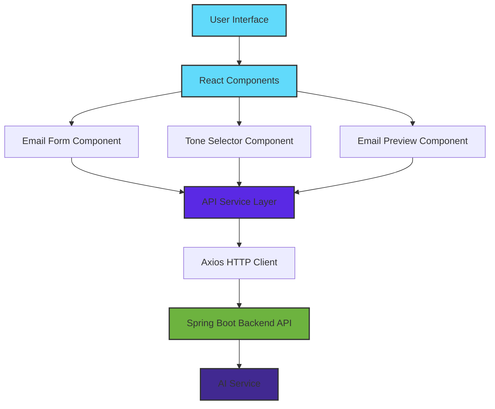

# AI Email Assistant Frontend

A modern, responsive React-based frontend application for the AI Email Assistant. This application provides an intuitive user interface for generating AI-powered email responses with customizable tones and contexts.

## 🛠️ Tech Stack

<div align="center">

### Frontend Framework


### Styling & UI


### Development Tools


### API Integration


</div>

## 🚀 Features

- **AI-Powered Email Generation**: Create professional email responses with AI assistance
- **Multiple Tone Options**: Choose from various tones (Professional, Casual, Friendly, Formal)
- **Real-time Preview**: See generated emails instantly
- **Responsive Design**: Works seamlessly on desktop, tablet, and mobile devices
- **User-Friendly Interface**: Clean and intuitive UI for easy navigation
- **Context-Aware Responses**: Provide additional context for more accurate email generation
- **Copy to Clipboard**: Quick copy functionality for generated emails
- **Fast Performance**: Built with Vite for lightning-fast development and production builds

## 📋 Prerequisites

Before you begin, ensure you have the following installed:

- **Node.js 16+** (LTS version recommended)
- **npm 8+** or **yarn 1.22+**
- **Git**
- Backend API running (see [backend repository](https://github.com/arindamdandapat11/Ai_email_assistant_backend))

## 🛠️ Installation

### 1. Clone the Repository

```bash
git clone https://github.com/arindamdandapat11/Ai_email_assistant_frontend.git
cd Ai_email_assistant_frontend
```

### 2. Install Dependencies

Using npm:

```bash
npm install
```

Or using yarn:

```bash
yarn install
```

### 3. Configure Environment Variables

Create a `.env` file in the project root:

```env
# Backend API Configuration
VITE_API_BASE_URL=http://localhost:8080/api
VITE_API_TIMEOUT=30000

# App Configuration
VITE_APP_NAME=AI Email Assistant
VITE_APP_VERSION=1.0.0
```

## 🚦 Running the Application

### Development Mode

Start the development server with hot-reload:

```bash
npm run dev
```

Or with yarn:

```bash
yarn dev
```

The application will be available at `http://localhost:5173` (or the next available port).

### Production Build

Build the application for production:

```bash
npm run build
```

Preview the production build:

```bash
npm run preview
```

### Linting

Run ESLint to check code quality:

```bash
npm run lint
```

## 🏗️ Project Structure

```
Ai_email_assistant_frontend/
├── public/                     # Static assets
│   ├── favicon.ico
│   └── ...
├── src/
│   ├── components/            # React components
│   │   ├── EmailForm.jsx     # Email input form
│   │   ├── EmailPreview.jsx  # Generated email preview
│   │   ├── Header.jsx        # Application header
│   │   ├── ToneSelector.jsx  # Tone selection component
│   │   └── ...
│   ├── services/             # API service layer
│   │   ├── api.js           # Axios configuration
│   │   └── emailService.js  # Email API calls
│   ├── utils/               # Utility functions
│   │   ├── validators.js    # Form validators
│   │   └── helpers.js       # Helper functions
│   ├── styles/              # CSS stylesheets
│   │   ├── App.css
│   │   ├── index.css
│   │   └── components/
│   ├── assets/              # Images, fonts, etc.
│   ├── App.jsx              # Main App component
│   └── main.jsx             # Application entry point
├── doc/                      # Documentation
├── .env                      # Environment variables
├── .gitignore
├── eslint.config.js          # ESLint configuration
├── index.html                # HTML entry point
├── package.json              # Dependencies and scripts
├── vite.config.js            # Vite configuration
└── README.md
```

## 🎯 Architecture

<div align="center">



</div>

## 🔧 Configuration

### Vite Configuration

Edit `vite.config.js` to customize build settings:

```javascript
import { defineConfig } from 'vite'
import react from '@vitejs/plugin-react'

export default defineConfig({
  plugins: [react()],
  server: {
    port: 5173,
    proxy: {
      '/api': {
        target: 'http://localhost:8080',
        changeOrigin: true,
      }
    }
  },
  build: {
    outDir: 'dist',
    sourcemap: true
  }
})
```

### ESLint Configuration

The project uses ESLint for code quality. Configuration is in `eslint.config.js`.

## 🌐 API Integration

### API Service Setup

The application uses Axios for HTTP requests:

```javascript
// src/services/api.js
import axios from 'axios';

const api = axios.create({
  baseURL: import.meta.env.VITE_API_BASE_URL,
  timeout: import.meta.env.VITE_API_TIMEOUT,
  headers: {
    'Content-Type': 'application/json',
  },
});

export default api;
```

### Example API Call

```javascript
// src/services/emailService.js
import api from './api';

export const generateEmail = async (emailData) => {
  try {
    const response = await api.post('/email/generate', emailData);
    return response.data;
  } catch (error) {
    throw error;
  }
};
```

## 🎨 Key Components

### Email Form Component

```jsx
// Handles user input for email generation
<EmailForm 
  onSubmit={handleGenerate}
  loading={isLoading}
/>
```

### Tone Selector Component

```jsx
// Allows users to select email tone
<ToneSelector 
  selectedTone={tone}
  onToneChange={handleToneChange}
  tones={['Professional', 'Casual', 'Friendly', 'Formal']}
/>
```

### Email Preview Component

```jsx
// Displays generated email with copy functionality
<EmailPreview 
  emailContent={generatedEmail}
  onCopy={handleCopy}
/>
```

## 🐳 Docker Deployment

### Dockerfile

```dockerfile
# Build stage
FROM node:18-alpine as build

WORKDIR /app
COPY package*.json ./
RUN npm install
COPY . .
RUN npm run build

# Production stage
FROM nginx:alpine
COPY --from=build /app/dist /usr/share/nginx/html
COPY nginx.conf /etc/nginx/conf.d/default.conf
EXPOSE 80
CMD ["nginx", "-g", "daemon off;"]
```

### Build and Run

```bash
docker build -t ai-email-assistant-frontend .
docker run -p 80:80 ai-email-assistant-frontend
```

### Docker Compose

```yaml
version: '3.8'
services:
  frontend:
    build: .
    ports:
      - "80:80"
    environment:
      - VITE_API_BASE_URL=http://backend:8080/api
    depends_on:
      - backend
```

## 📱 Responsive Design

The application is fully responsive and optimized for:

- **Desktop**: 1920px and above
- **Laptop**: 1366px - 1920px
- **Tablet**: 768px - 1366px
- **Mobile**: 320px - 768px

## 🧪 Testing

### Unit Tests (Optional Setup)

Install testing libraries:

```bash
npm install --save-dev @testing-library/react @testing-library/jest-dom vitest
```

Run tests:

```bash
npm run test
```

## 🔐 Security Best Practices

- **Environment Variables**: Never commit `.env` files
- **API Keys**: Store sensitive data in environment variables
- **HTTPS**: Use HTTPS in production
- **Input Validation**: Validate all user inputs
- **XSS Protection**: React automatically escapes content
- **CORS**: Configure CORS properly on the backend

## 📝 Environment Variables

| Variable | Description | Required | Default |
|----------|-------------|----------|---------|
| `VITE_API_BASE_URL` | Backend API base URL | Yes | http://localhost:8080/api |
| `VITE_API_TIMEOUT` | API request timeout (ms) | No | 30000 |
| `VITE_APP_NAME` | Application name | No | AI Email Assistant |
| `VITE_APP_VERSION` | Application version | No | 1.0.0 |

## 🤝 Contributing

1. Fork the repository
2. Create a feature branch (`git checkout -b feature/AmazingFeature`)
3. Commit your changes (`git commit -m 'Add some AmazingFeature'`)
4. Push to the branch (`git push origin feature/AmazingFeature`)
5. Open a Pull Request

### Code Style Guidelines

- Use functional components with hooks
- Follow ESLint configuration
- Write meaningful component and variable names
- Comment complex logic
- Keep components small and focused

## 🐛 Troubleshooting

### Common Issues

**Issue**: Application fails to start
- **Solution**: Ensure Node.js 16+ is installed. Delete `node_modules` and run `npm install` again.

**Issue**: API calls failing
- **Solution**: Verify the backend is running and `VITE_API_BASE_URL` is correct in `.env`

**Issue**: Build errors
- **Solution**: Clear the build cache: `rm -rf dist node_modules && npm install && npm run build`

**Issue**: Hot reload not working
- **Solution**: Check if port 5173 is available. Try restarting the dev server.

**Issue**: Environment variables not loading
- **Solution**: Ensure variables are prefixed with `VITE_`. Restart the dev server after changes.

**Issue**: CORS errors in browser
- **Solution**: Configure CORS settings in the backend. Use Vite proxy in development.

## 📚 Additional Resources

- [React Documentation](https://react.dev/)
- [Vite Documentation](https://vitejs.dev/)
- [Axios Documentation](https://axios-http.com/)
- [ESLint Documentation](https://eslint.org/)
- [Backend Repository](https://github.com/arindamdandapat11/Ai_email_assistant_backend)

## 🗺️ Roadmap

- [ ] Add TypeScript support
- [ ] Implement email templates library
- [ ] Add dark mode theme
- [ ] Implement email history feature
- [ ] Add user authentication
- [ ] Support for email attachments preview
- [ ] Multi-language support (i18n)
- [ ] Add email scheduling feature
- [ ] Implement keyboard shortcuts
- [ ] Add accessibility improvements (WCAG 2.1)

## 📄 License

This project is licensed under the MIT License - see the LICENSE file for details.

## 👤 Author

**Arindam Dandapat**
- GitHub: [@arindamdandapat11](https://github.com/arindamdandapat11)
- Repository: [Ai_email_assistant_frontend](https://github.com/arindamdandapat11/Ai_email_assistant_frontend)

## 💬 Support

For support, email arindamdandapat11@example.com or open an issue in the GitHub repository.

## 🙏 Acknowledgments

- React team for the amazing framework
- Vite team for the blazing fast build tool
- The open-source community

---

**Note**: This frontend application requires the backend API to be running. Make sure to set up and start the [backend service](https://github.com/arindamdandapat11/Ai_email_assistant_backend) before using this application.

## 🚀 Quick Start

1. **Clone and install**:
   ```bash
   git clone https://github.com/arindamdandapat11/Ai_email_assistant_frontend.git
   cd Ai_email_assistant_frontend
   npm install
   ```

2. **Configure environment**:
   ```bash
   cp .env.example .env
   # Edit .env with your backend API URL
   ```

3. **Start development server**:
   ```bash
   npm run dev
   ```

4. **Open in browser**: Visit `http://localhost:5173`

Happy coding! 🎉
